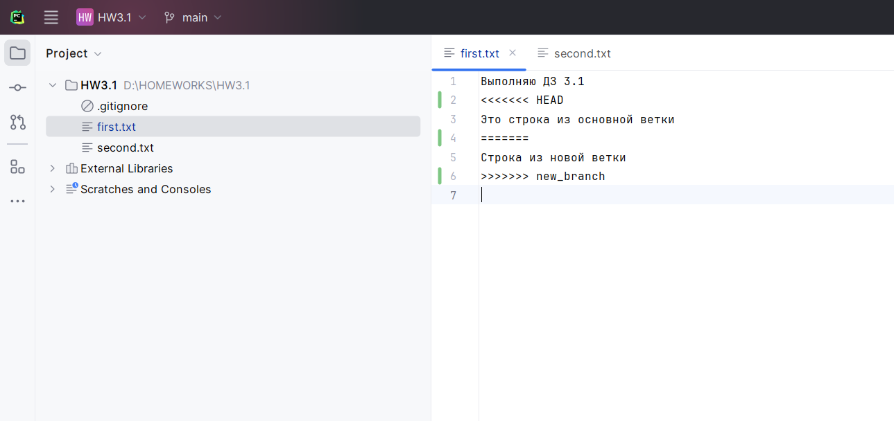

# Задание

1. Инициализировать пустой локальный git-репозиторий.

2. Создать текстовый файл “first.txt” с произвольным содержанием, добавить его в репозиторий, сделать коммит

3. Создать другой произвольный текстовый файл (second.txt), добавить его в репозиторий, сделать коммит.

4. Создать новую ветку “new_branch”, переключиться в эту ветку. Внести изменения в файл first.txt (добавить в конец строку “Строка из новой ветки”). Сделать коммит.

5. Переключиться в основную ветку. Внести изменения в файл first.txt (Добавить в конец строку “Это строка из основной ветки”). Сделать коммит.

6. Слить изменения из ветки new_branch в основную ветку. Разрешить конфликт слияния (применить оба изменения из веток). Проверить статус после разрешения конфликта, сделать скриншот.

7. Зарегистрироваться в сервисе GitLab/GitHub, создать новый репозиторий.

8. Добавить только что созданный удаленный репозиторий к локальному, отправить в удаленный репозиторий изменения из обеих веток.

9. Отправить ссылку на удаленный репозиторий на проверку (вставить ссылку в текстовое поле).
